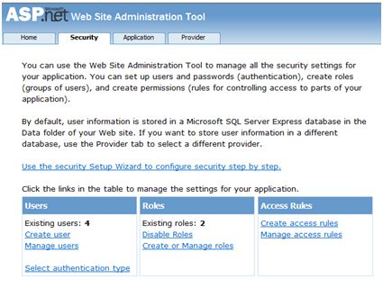
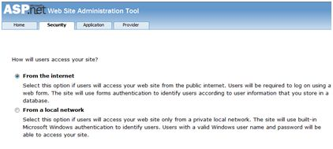
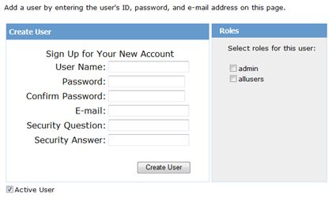
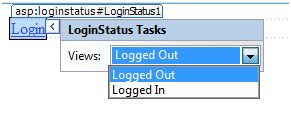
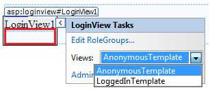
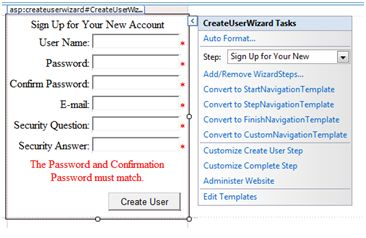
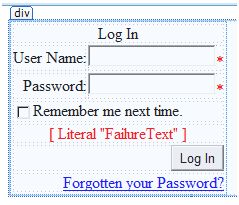
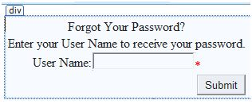
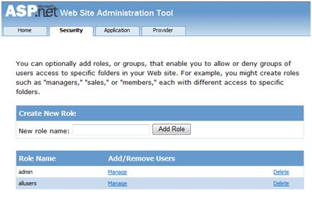
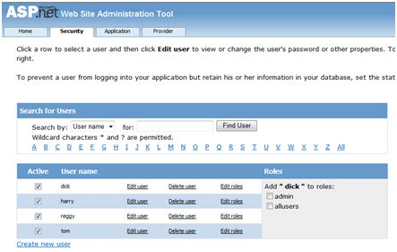

# ASP.NET - 安全性
实现网站的安全性关系到如下几方面：  

- **身份认证**:即确认用户身份和真实性的过程。ASP.NET中提供了四种类型的认证：  
 - Windows认证
 - 表单认证
 - 身份验证
 - 自定义认证
- **授权**：即定义并为特定用户分配特定角色的过程。
- **机密性**：包括对客户端浏览器和网络服务器的加密。
- **完整性**：保持数据完整性。例如，实现数字签名。

## 基于表单的认证
一般来讲，基于表单的认证包括编辑网络配置文件以及具有验证码的注册页面。  
网络配置文件可由如下代码编写：  

```
<configuration>

<system.web>
    <authentication mode="Forms">
        <forms loginUrl ="login.aspx"/>
    </authentication>
   
    <authorization>
        <deny users="?"/>
    </authorization>
</system.web>
...
...
</configuration>
```

上面的代码段中提及的login.aspx页面可能会包含如下代码，包含验证用的用户名和密码在文件之后很难编码进去。

```
protected bool authenticate(String uname, String pass)
{
    if(uname == "Tom")
    {
        if(pass == "tom123")
            return true;
    }
   
    if(uname == "Dick")
    {
        if(pass == "dick123")
            return true;
    }
   
    if(uname == "Harry")
    {
        if(pass == "har123")
            return true;
    }
   
    return false;
}

public void OnLogin(Object src, EventArgs e)
{
    if (authenticate(txtuser.Text, txtpwd.Text))
    {
        FormsAuthentication.RedirectFromLoginPage(txtuser.Text, chkrem.Checked);
    }
    else
    {
        Response.Write("Invalid user name or password");
    }
}
```

我们要注意到FormsAuthentication类是用于认证过程的。  
然而，不用写任何代码Visual Studio就能够通过网站管理工具轻松地无缝实现用户创建、身份认证和授权。这种工具能够实现用户和角色的创建。  
除此之外，ASP.NET有现成的登录控制系列，可以为你控制执行所有的工作。  
## 基于表单的安全性的实现
为了建立基于表单的认证，你需要做到如下几点：

- 支持认证过程的用户数据库
- 一个使用数据库的网站
- 用户账户
- 角色
- 用户活动和群体活动的限制
- 一个显示用户状态及其他信息的用户页面
- 允许用户登录、找回密码、修改密码的登录界面。

为了创建一个用户，需要采取以下步骤：  
**第一步：**选择网站->配置ASP.NET以打开网络应用管理工具  
**第二步：**点击安全选项。  
  
**第三步：**选择“来自网络”选项，以将认证类型设定为“基于表单的认证”。  
  
**第四步：**点击“创建用户”。如果你已经创建了角色，你正好可以在这一步把角色分配给该用户。  
  
**第五步：**创建一个网站，并添加如下页面。  

- 欢迎页面
- 登录页面
- 注册页面
- 找回密码页面
- 修改密码页面

**第六步：**在欢迎页面的登录部分设置一个登录状态控件。包含两个标准框：LoggedIn和LoggedOut。  
LoggedIn有查看已经登录用户的选项，LoggedOut内有查看已经退出用户的选项。你可以在属性窗口里改变登录和退出的文本属性。  
  
**第七步：**在LoginStatus控件的下面设置一个LoginView控件。你可以在此设置一些能反应用户是否已经登录的其他文本或其他控件（如超链接、按钮等）。  
这个控件有两个标准框：Anonymous框和LoggedIn框。选择每种视图，并为用户编写一些文本，以作为选择标准框时要显示的内容。文本应该被放在如下图中标红的区域。  
  
**第八步：**由开发者创建应用用户。你也许想要允许游客也能够创建一个用户账户。要实现这个，你可以在LoginView控件下添加一个可以转到注册页面的链接。  
**第九步：**在注册页面设置一个CreateUserWizard控件。设置这个控件的ContinueDestinationPageUrl属性，以保证能够转到欢迎页面。  
  
**第十步：**创建登录页面。在这个页面上设置一个登陆路控件。LoginStatus控件会自动地连接到登录页面。在网络配置文件里做如下改动可以改变这种默认设置。  
例如，如果你把你的登录页面命名为signup.aspx，可以在网络配置文件的<认证>部分添加如下几行代码。  

```
<configuration>
    <system.web>
        <authentication mode="Forms">
            <forms loginUrl ="signup.aspx" defaultUrl = “Welcome.aspx” />
        </authentication>
    </system.web>
</configuration>
```

**第十一步：**用户经常会忘记密码。PasswordRecovery控件帮助用户重新获得登录这个账户。选择登录控件。打开它的小标签，并选择“转到标准框”。  
通过自定义这个控件的用户界面，在登录按钮下方放置一个超链接控件，这个控件应该是能够链接到找回密码页面的。  
  
**第十二步：**在找回密码页面设置一个PasswordRecovery控件。这个控件需要邮件服务器把密码发送给用户。  
  
**第十三步：**在欢迎页面的LoginView控件的LoggedIn框内设置一个转到修改密码页面的链接。  
  
**第十四步：**在修改密码页面设置一个ChangePassword控件，这个控件有两种视图：  
  
现在运行这个应用，观察不同的安全操作。  
可以回到网络应用管理工具，点击安全选项，来创建角色。点击“创建角色”为这个应用来创建一些角色。  
  
点击“管理用户”，可以给用户分配角色。  
  
## IIS认证：SSL
安全套接层（SSL）是用来确保安全连接的协议。通过使用SSL，浏览器会把送到服务器的所有数据加密，并解密来自服务器的所有数据。与此同时，服务器也会对俩字浏览器的所有数据进行加解密。
安全连接的URL使用的是HTTPS协议而不是HTTP协议。一个很小的加锁也会被使用了安全连接的浏览器显示出来。当浏览器使用SSL主动地与服务器进行交流时，服务器会发送一个安全证书以对服务器本身进行认证。  
要想使用SSL，你需要从一个可以信任的认证机构（CA）购买一个数字安全证书，并在网络服务器上安装这个证书。以下是一些可以信任的，有较好名誉认证机构:  

- www.verisign.com
- www.geotrust.com
- www.thawte.com

SSL是建立在所有主要的浏览器和服务器上的。要启用SSL，你需要安装数字证书。不同数字证书的强度不同，是根据加密过程中产生的密钥长度而有所区别。密钥越长，证书就越安全，连接也就越安全。  


|强度   | 描述         |
|:---------|:------------|  
|40比特|支持大多数浏览器但是很容易破解。 |  
|56比特|比40比特的更健壮。|
|128比特|很难破解，但并不是所有的浏览器都支持。|

